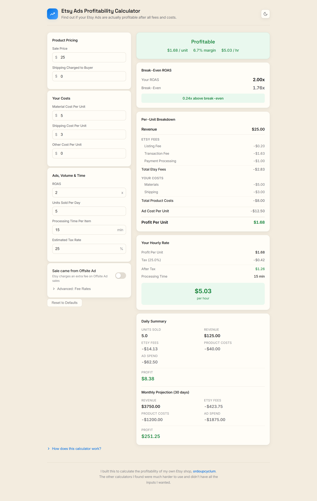
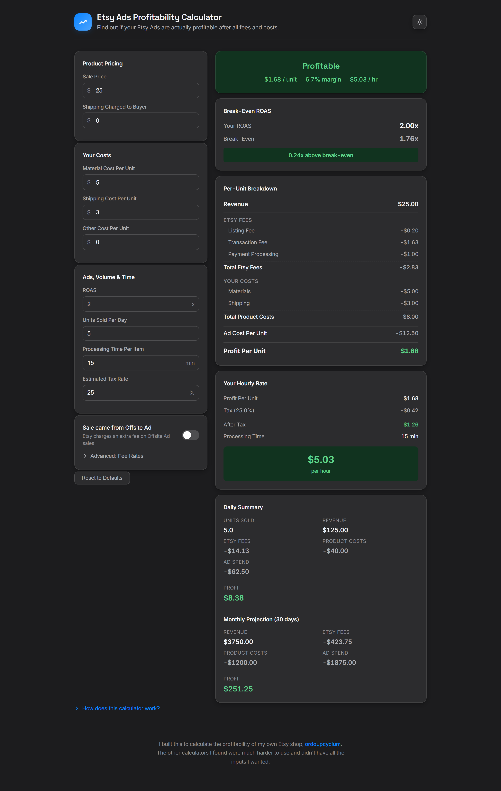

# Etsy Ads Profitability Calculator

> Find out whether your Etsy Ads are **actually** profitable — after every fee, cost, tax, and the value of your time.

[](https://github.com/jfreal/etsyroas/actions/workflows/ci.yml)
[](LICENSE)
[](https://vuejs.org/)
[](https://www.typescriptlang.org/)
[](https://vite.dev/)
[](https://prettier.io/)

**[▶ Live demo](https://etsyroas.netlify.app)**

A ROAS number on its own doesn't tell an Etsy seller whether a sale made money. Etsy takes a
listing fee, a transaction fee, and payment processing on every order — and that's before
materials, shipping, taxes, and the hours spent making and packing each item. This calculator
folds all of it into a single, honest answer: **profit per unit, break-even ROAS, and your real
hourly rate.** It runs entirely in your browser, stores nothing on a server, and remembers your
numbers between visits.



---

## Why I built this

I run a small Etsy shop — [ordoupcyclum](https://ordoupcyclum.etsy.com/) — and every time I turned
on Etsy Ads I had the same nagging question: _am I actually making money?_ Etsy's ROAS number alone
won't tell you; the real answer only shows up once you subtract every fee, your own per-item costs,
taxes, and the time you spend making and packing each order.

The calculators I could find were either clunky to use or missing the inputs that actually mattered
to me — my materials and shipping costs, my processing time, the Offsite Ads fee. None of them gave
me a straight answer, so I built the one I wanted: every input in one tidy place, and an instant
verdict on whether an order is profitable, breaking even, or quietly losing money. I use it on my
own shop, and figured other sellers might find it handy too.

---

## Features

- **Instant verdict** — a clear _Profitable / Breaking Even / Losing Money_ banner with profit per
  unit, margin, and effective hourly rate.
- **Break-even ROAS** — the single most important number: the minimum ROAS at which your ads stop
  costing you money. It even tells you when a product can't be profitable at any ROAS.
- **Full per-unit breakdown** — every Etsy fee and cost itemized so you can see exactly where the
  money goes.
- **Effective hourly rate** — after-tax profit divided by your hands-on time, so you know what
  you're really earning.
- **Daily & monthly projections** — scale a single sale up to a realistic income picture.
- **Accurate Etsy fee model** — listing, transaction, payment-processing, and Offsite Ads fees,
  pre-filled with Etsy's US defaults and fully overridable when the rates change.
- **Dark mode** — automatic system-preference detection with a manual toggle that remembers your
  choice.
- **Privacy-friendly & offline-capable** — no accounts, no tracking, no backend. Inputs persist
  locally via `localStorage`.
- **Responsive** — a comfortable two-column layout on desktop that collapses cleanly to one column
  on mobile.

## Screenshots

|                  Light                   |                  Dark                  |
| :--------------------------------------: | :------------------------------------: |
|  |  |

## How it works

Everything is derived from a single sale (“per unit”) and then scaled up. The full model lives in
[`src/composables/useCalculator.ts`](src/composables/useCalculator.ts) and is covered by unit tests.

```text
revenue        = salePrice + shippingCharged
etsyFees       = listingFee
               + transactionRate%      × revenue
               + processingRate%       × revenue + processingFlat
               + offsiteRate%          × revenue        (only if the sale came from an Offsite Ad)
productCosts   = materials + shipping + other
adCost         = revenue ÷ ROAS         (ROAS = revenue ÷ adSpend, solved for adSpend)

profit         = revenue − etsyFees − productCosts − adCost
```

The **break-even ROAS** is the ROAS at which `profit` is exactly zero. Setting the profit equation
to `0` and solving for ROAS gives a tidy closed form:

```text
breakEvenRoas  = revenue ÷ (revenue − etsyFees − productCosts)
```

If `revenue − etsyFees − productCosts` is zero or negative, the product loses money before a single
ad dollar is spent, so the break-even ROAS is reported as “not viable” (∞).

Finally, the **effective hourly rate** translates per-unit profit into the value of your time:

```text
afterTaxProfit       = profit × (1 − taxRate%)          (a loss passes through untaxed)
effectiveHourlyRate  = afterTaxProfit ÷ processingMinutes × 60
```

> **A worked example (the defaults):** a \$25 item at 2.0× ROAS with \$8 of costs nets \$1.68 profit
> per unit, a 6.7% margin, a break-even ROAS of **1.76×**, and an effective rate of **\$5.03/hr**.

## Tech stack

- **[Vue 3](https://vuejs.org/)** with `<script setup>` and the Composition API
- **[TypeScript](https://www.typescriptlang.org/)** in `strict` mode (plus `noUnusedLocals`,
  `noUnusedParameters`)
- **[Vite 7](https://vite.dev/)** for the dev server and build
- **[Vitest](https://vitest.dev/)** + **[@vue/test-utils](https://test-utils.vuejs.org/)** for unit
  and component tests
- **[ESLint](https://eslint.org/)** (flat config) + **[Prettier](https://prettier.io/)**
- **GitHub Actions** CI and **Netlify** for hosting
- **Self-hosted fonts** — Inter + Space Grotesk (variable) via `@fontsource`, bundled at build time
  so there are no Google Fonts / CDN requests
- **Lean runtime** — just Vue and the bundled fonts; state is plain reactive refs persisted to
  `localStorage`

## Getting started

**Prerequisites:** [Node.js](https://nodejs.org/) 20+ and npm.

```bash
# Clone and install
git clone https://github.com/jfreal/etsyroas.git
cd etsyroas
npm install

# Start the dev server (http://localhost:5173)
npm run dev
```

### Available scripts

| Script              | What it does                                     |
| ------------------- | ------------------------------------------------ |
| `npm run dev`       | Start the Vite dev server with hot-module reload |
| `npm run build`     | Type-check and build for production into `dist/` |
| `npm run preview`   | Preview the production build locally             |
| `npm run test`      | Run the test suite in watch mode                 |
| `npm run test:run`  | Run the test suite once (CI mode)                |
| `npm run coverage`  | Run tests and report coverage                    |
| `npm run typecheck` | Type-check the project with `vue-tsc`            |
| `npm run lint`      | Lint with ESLint                                 |
| `npm run format`    | Format the codebase with Prettier                |

## Project structure

```text
etsyroas/
├── index.html                      # App shell, meta/social tags, no-flash theme init
├── netlify.toml                    # Netlify build & SPA-redirect config
├── src/
│   ├── App.vue                     # Layout: input panel + results column
│   ├── main.ts                     # App entry
│   ├── assets/
│   │   └── main.css                # Design tokens (light/dark) + global styles
│   ├── components/
│   │   ├── InputPanel.vue          # All input sections
│   │   ├── InputGroup.vue          # Reusable labelled number input
│   │   ├── FeeSettings.vue         # Collapsible advanced fee overrides
│   │   ├── CollapsibleSection.vue  # Reusable disclosure widget
│   │   ├── VerdictBanner.vue       # Profitable / breaking even / losing
│   │   ├── BreakEvenDisplay.vue
│   │   ├── BreakdownTable.vue      # Itemized per-unit breakdown
│   │   ├── HourlyRate.vue
│   │   ├── DailySummary.vue        # Daily & monthly projections
│   │   ├── HowItWorks.vue          # In-app explainer
│   │   └── ThemeToggle.vue
│   └── composables/
│       ├── useCalculator.ts        # The complete profitability model (+ tests)
│       ├── useFormatters.ts        # Currency / percent / ROAS formatting (+ tests)
│       ├── useLocalStorage.ts      # Reactive, persisted refs (+ tests)
│       └── useTheme.ts             # Light/dark theme state
└── .github/workflows/ci.yml        # Type-check · lint · format · test · build
```

## Testing

The financial model is the heart of the app, so it's the most thoroughly tested part: every fee,
the break-even formula, the offsite-ads path, divide-by-zero guards, and the daily/monthly
projections are verified against hand-computed values.

```bash
npm run test:run
```

## A note on accuracy

Fee rates are pre-filled with Etsy's **US** defaults as of 2025 and can be overridden in the
_Advanced: Fee Rates_ section. Etsy's fees vary by country and change over time, so always confirm
against [Etsy's current fee schedule](https://help.etsy.com/hc/en-us/articles/360000343968) for your
shop. This is an independent tool and is **not affiliated with or endorsed by Etsy, Inc.**

## License

Released into the public domain under the [Unlicense](LICENSE) — do anything you like with it.
